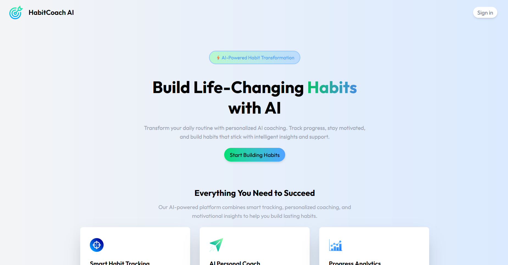
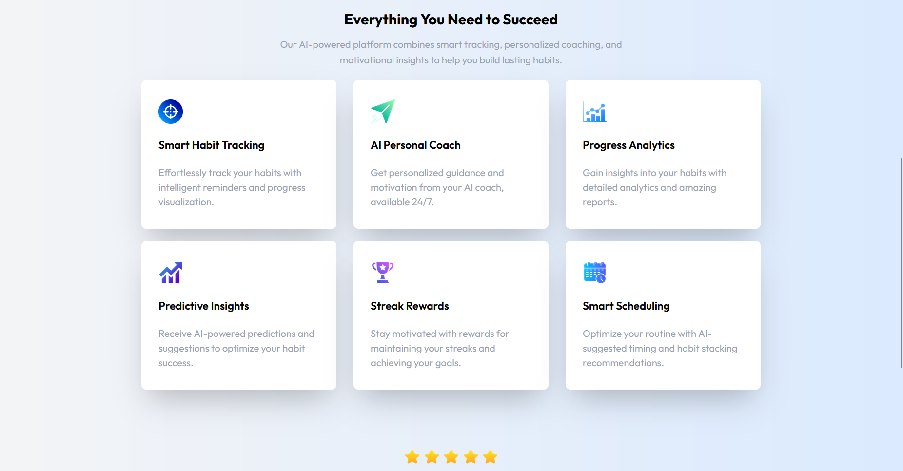
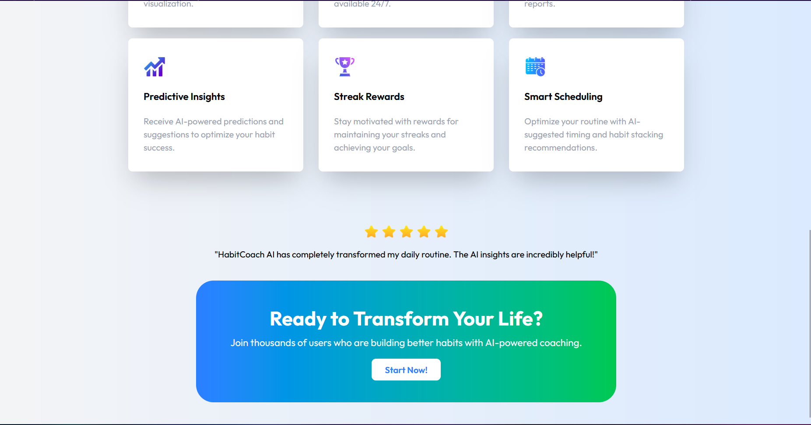
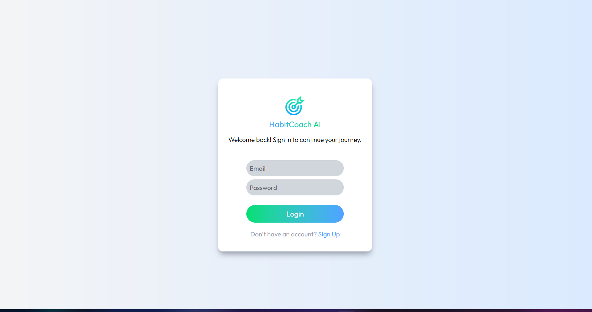
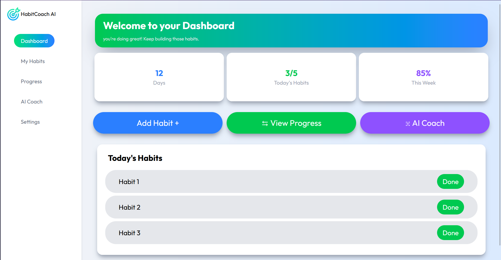
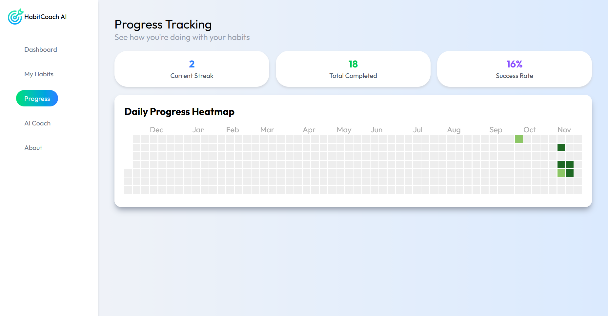

# 🧠 AI Habit Coach 

AI Habit Coach is a MERN-based application designed to help users build better habits. It supports CRUD operations for managing habits, progress tracking with charts, and an AI-powered chatbot to discuss habits and get personalized guidance.

---

## 🚀 Features
- ✅ Create, Read, Update, and Delete habits  
- 📊 Track progress with interactive charts  
- 🤖 AI Chatbot for habit-related discussions  
- 🔐 User authentication & secure data handling  
- 🌐 Built with the MERN stack (MongoDB, Express, React, Node.js)  

---

## 🛠️ Tech Stack
- **Frontend:** React, Chart.js, TailwindCSS  
- **Backend:** Node.js, Express.js  
- **Database:** MongoDB  
- **AI Integration:** Chatbot powered by AI API  

---

## 📸 Screenshots
  <p align="center">
  
  
  
  
  
  
  
  
</p>


## 📂 Project Structure

ai-habit-coach/
│── client/       # React frontend
│── server/       # Express backend
│── models/       # MongoDB models
│── routes/       # API routes
│── controllers/  # Business logic
│── .env          # Environment variables


---

## ⚙️ Installation

1. Clone the repository:
   ```bash
   git clone https://github.com/your-username/ai-habit-coach.git
   cd ai-habit-coach

cd client
npm install
cd ../server
npm install

MONGO_URI=your_mongodb_connection_string
JWT_SECRET=your_secret_key
AI_API_KEY=your_ai_api_key


# Start backend
cd server
npm run dev

# Start frontend
cd client
npm start

